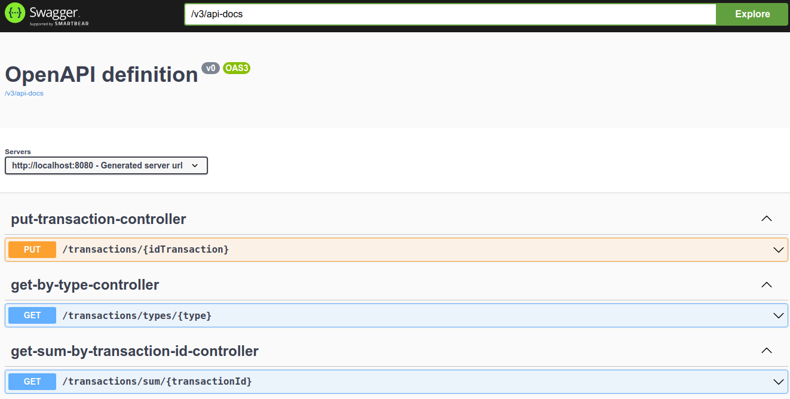

# challenge
By Rodrigo Enjamio
Encargado por Mendel

# Consideraciones
-Para buscar las transacciones que están conectadas transitivamente no se usó una query SQL, ya que el
enunciado pedía explicitamente que no se haga por SQL, siendo que quizas sea una mejor opcion, ya que evitamos
tener que hacer un select por cada hijo. Y evitamos la posibilidad de que pueda dar un error por heap size.
Para verificar esto se debería hacer test de stress con jmeter.
-TransactionType se definio como Enum, pero podría ser una Entidad dependiendo si cambian o no 
los tipos de transacciones.
-Al crear una transaccion con PUT se retorna STATUS=200 (porque lo pedía el enunciado) pero en general
se devuelve 201 al crear un recurso.

# Tecnologias Utilizadas:
- Java 17: El core de la app
- SpringBoot: Api para dar manejo de aplicacion Rest
- H2: BD embebida.
- jUnit, mokito, hamcrest: Testing
- Lombok: Para no declarar setters, getters etc
- Maven: Gestion del proyecto
- OpenApi3: Documentador de API endpoints.
- Jacoco: Cobertura y reportes
- SOLID, DDD y Arquitectura Hexagonal.

# Instrucciones para lanzar la aplicacion en localhost
Una vez clonado ir a la carpeta mendel y desde la consola

- Perfil dev (usa una BD h2)

  mvn spring-boot:run

- Acceder via explorador a:
  - Health: localhost:8080/actuator/health 
  - Metricas: localhost:8080/actuator/prometheus 
  - OpenAPI3: localhost:8080/swagger-ui.html

# Levantar la aplicación con docker:
- En la carpeta  carpeta mendel:
  mvn clean install (para generar la imagen)
  docker run -p 8080:8080 challenge_mendel

- Para mas informacion ver documento ./doc/Evidencias challenge-mendel.docx

